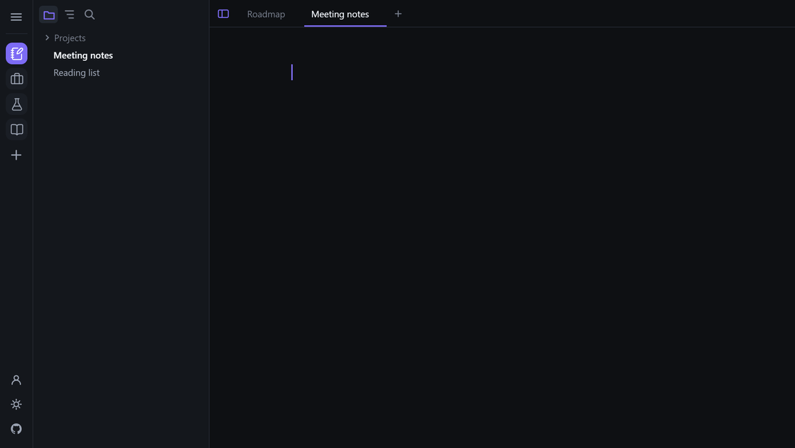

# Nib

  
  
  
  

  
  
  

  

A simple, lightweight markdown editor offering all the features you could ever need. 

See for yourself: [nibeditor.com](https://nibeditor.com)

## Why Nib?

|  | Open source | MCP | Platform independent | Inline preview | Sync | Publish |
| --- | :-: | :-: | :-: | :-: | :-: | :-: |
| **Nib** | ✅ | ✅ | ✅ | ✅ | ✅ | ✅ |
| Typora | ❌ | ❌ | ✅ | ✅ | ❌ | ❌ |
| MarkText | ✅ | ❌ | ✅ | ✅ | ❌ | ❌ |
| Obsidian | ❌ | ❌ | ✅ | ✅ | ❌ | ❌ |
| Zettlr | ✅ | ❌ | ✅ | ✅ | ❌ | ❌ |
| Joplin | ✅ | ❌ | ✅ | ✅ | ✅ | ❌ |
| Logseq | ✅ | ❌ | ✅ | ✅ | ❌ | ✅ |
| iA Writer | ❌ | ❌ | ❌ | ❌ | ❌ | ✅ |
| Bear | ❌ | ❌ | ❌ | ✅ | ❌ | ❌ |
| VS Code | ✅ | ✅ | ✅ | ❌ | ❌ | ❌ |
| Sublime Text | ❌ | ❌ | ✅ | ❌ | ❌ | ❌ |

## Features

- A **clean** and **modern** UI
- **Realtime preview** (WYSIWYG)
- **Syncing** across different devices
- An **MCP** to allow LLM read and write access
- **Paste Images** from Clipboard
- **Publish** your markdown files as an online blog with a single click
