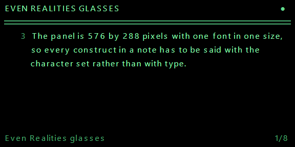
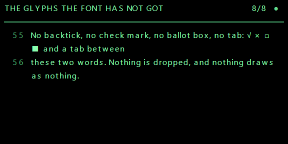
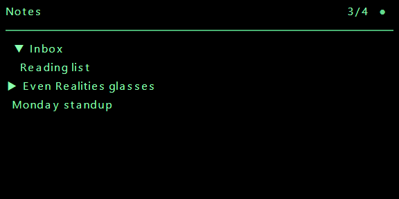
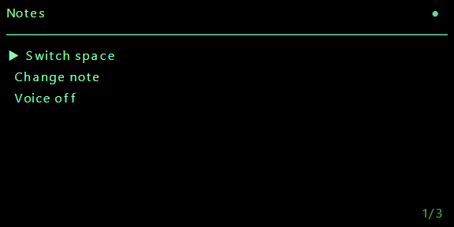
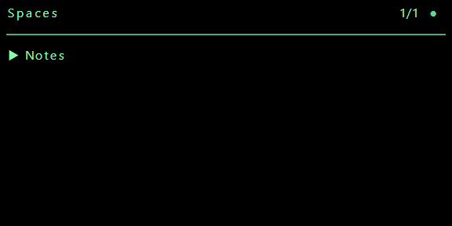
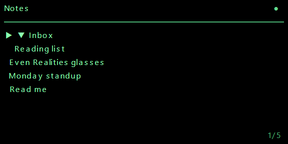
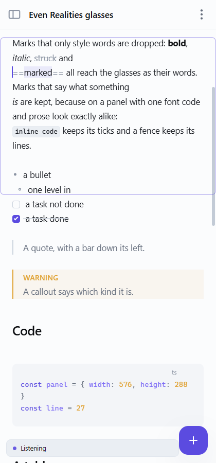
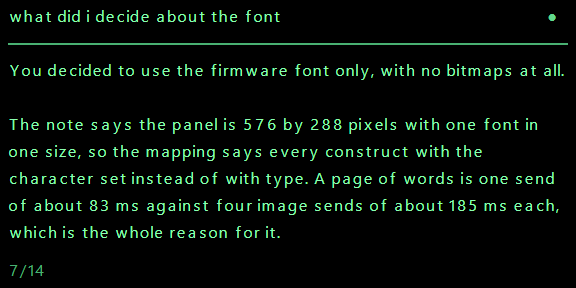
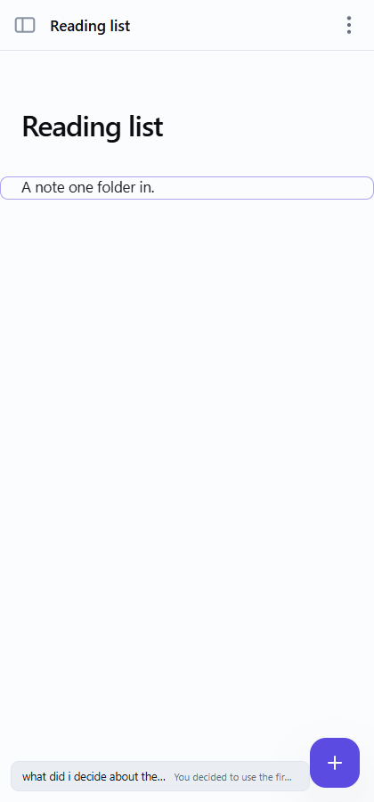

# Nib on the Even Realities G2

The plugin is the web app with one thing added: a bridge that keeps the glasses
showing whatever note is active in it, and lets the glasses say back which note
that should be. Same components, same stores, same browser storage, same sign-in,
same sync. It is served at `https://nibeditor.com/even/`, and it does nothing at
all in a browser that has no glasses behind it.

**Everything on the panel is text.** No image container is made at all: a page of
words is one call of about 83 ms where four image sends are 740, and the whole of
what a note means has to be said in one font in one size with no alignment. How
that is done is section 3, and it is the most interesting page here.



Everything below was written against **`@evenrealities/even_hub_sdk` 0.0.15**
(published 2026-09-07), **`@evenrealities/evenhub-cli` 0.1.14** and
**`@evenrealities/evenhub-simulator` 0.9.5**. Where a fact came from the SDK's
own `dist/index.d.ts` or from a published document it is stated as such; where it
is an assumption, it says so.

---

## 1. The platform

### How an app is put together

An Even Hub app is a web page. The Even Realities phone app opens it in a
WebView (Chromium on Android, WKWebView on iOS) and the page talks to the
glasses over a channel the phone owns; no code of ours runs on the glasses
themselves. There are two ways to get a page in front of a pair:

- **Development.** `evenhub qr --url <address>` prints a QR code; the phone app
  scans it and loads that address directly over the network. Hot reloading
  works. The WebView is suspended whenever the phone app goes to the background,
  which is why this mode cannot be used to satisfy a review.
- **Release.** `evenhub pack app.json <build folder>` writes an `.ehpk`, which is
  uploaded in the developer portal and installed through the phone app. Files are
  served to the WebView from the phone.

The SDK is an ordinary npm dependency, but it is only a wrapper over a bridge the
host injects. Importing it puts a singleton on `window.EvenAppBridge`, a message
handler on `window._listenEvenAppMessage`, and sends everything out through
`window.flutter_inappwebview.callHandler('evenAppMessage', …)`. Outside that
WebView every call fails, which is why `sdk.ts` checks for the host handler
before importing the SDK at all.

### `app.json`

`apps/desktop/even.app.json`. Nine keys, and the CLI's own schema accepts no
others (extra keys are dropped silently, which is worth knowing before inventing
one). There is **no icon field**: the portal takes the icon as an upload.

| Key | Rule |
| --- | --- |
| `package_id` | reverse domain, `^[a-z][a-z0-9]*(\.[a-z][a-z0-9]*)+$`. No hyphens, no underscores. |
| `edition` | exactly `"202601"` |
| `name` | at most 20 characters, and **must not contain "Even"** in any case: names that do are rejected as impersonation |
| `version` | `x.y.z`, no prefix, no pre-release |
| `min_app_version` | the phone app floor; `evenhub pack` stamps it from the SDK unless `--enforce-manual-version` |
| `min_sdk_version` | the SDK built against |
| `entrypoint` | a path inside the build folder: for us `even.html` |
| `permissions` | array of `{ name, desc }`, plus `whitelist` for `network`. The plugin asks for `network` and `microphone`. |
| `supported_languages` | from `en de fr es it zh ja ko`. Swiss German has no code here, so it is not listed. |

Our `network` whitelist is `https://nibeditor.com` and `https://api.openai.com`:
one entry per full origin, no wildcards, no bare hostnames. The second is where a
spoken question goes, with the account's own key and nothing of ours in the middle;
without it on this list the phone app blocks the request before it leaves the
WebView. The phone app blocks any request to a host that
is not on it before the request leaves the WebView, and CORS still applies on top
of that. See "What still has to be decided" below.

### The display

- **576 by 288 pixels, four bits a pixel: sixteen levels of green.** Level zero
  is a pixel that is off, which on these glasses is see-through rather than
  black. So a page is drawn as light on nothing.
- At most **four image containers and eight text or list containers**, twelve in
  all, and exactly one of them must carry `isEventCapture: 1`. The plugin makes
  seven text containers and no image container at all; see section 2.
- An **image container is at most 288 wide and 144 tall**, so a panel takes exactly
  four of them, which is also the most that are allowed. None is made.
- An image container **cannot** capture events, and neither can a text container
  holding anything that overflows it: the capture layer is a full-screen text
  container with a single space in it, behind everything, so a scroll is at both
  ends of it at once and reaches us instead of scrolling something invisible.
  `zOrderIndex` decides the stacking and does not touch input routing.
- A **text container has no typography at all**: one font baked into the
  firmware, no family, no size, no weight, no slant, no alignment, a fixed 27
  pixel line, and five brightness levels (`textColor` 0 to 4). This is the single
  most important fact on this page; see section 3.
- `updateImageRawData` takes `{ containerID, containerName, imageData }` and
  nothing else: no width, no height, no stride. The container says how wide the
  rows are. `imageData` may be a `number[]`, a `Uint8Array`, an `ArrayBuffer` or
  base64, and the plugin sends `number[]`, which the SDK's own note says the host
  takes best.
- **Encoded image bytes (PNG) are the documented format**: the host decodes,
  scales and does its own reduction to four bits, and its own display notes say
  its reduction is better than one done in the app. Raw Gray8 and packed Gray4
  are also accepted (simulator changelog 0.9.2), but **the packed byte layout is
  not published anywhere** - not the nibble order, not the row padding. So the
  plugin sends PNG. `encode.ts` can pack Gray4 and is tested round trip, and
  `Sheets` will use it on request, but it is not the default and its layout is an
  assumption until somebody publishes one.
- Compression is not an API. SDK 0.0.12 added LZ4 inside the image path; there is
  no flag.

### What a page costs

Measured on a G2 (firmware 2.2.7.14, Even App 2.2.7, SDK 0.0.13) and published in
the community notes:

| Call | Cost |
| --- | --- |
| `updateImageRawData` | about 104 ms fixed, plus 3.9 ms per KB of the gray4 buffer |
| `rebuildPageContainer` | about 165 ms, flat, whatever it holds |
| `textContainerUpgrade` | about 83 ms |
| `createStartUpPageContainer` | 100 to 135 ms |

The fit is `ms = 104 + 0.0039 x bytes`, where `bytes` is `width x height / 2`,
the gray4 buffer, not the size of the PNG. The costs are **additive across
containers**: one 58 by 58 container is 111 ms a frame, two are 221, four are
442. SDK 0.0.14 added a 100 ms hold on the image path on top of that, which is a
floor rather than the same thing.

For a full panel: each quadrant is 288 x 144 = 20,736 bytes of gray4, so about
104 + 81 = **185 ms a quadrant, 740 ms for all four**. The published table
measures exactly that for a 288 by 144 container.

### Input

Everything arrives through one subscription, `onEvenHubEvent`. The gestures are
`CLICK`, `DOUBLE_CLICK`, `SCROLL_TOP`, `SCROLL_BOTTOM`, `LONG_PRESS` and
`LONG_PRESS_RELEASE`. `eventSource` says whether it came off the right temple
(1), the R1 ring (2) or the left temple (3).

**The ring is not a separate input surface.** It sends the same gestures a temple
sends and is told apart only by `eventSource`. There is no rotation, no encoder,
no delta. Head gestures are not exposed either: the only head data is raw IMU
through `imuControl`. This is why the plugin turns pages rather than scrolling
smoothly, and it is not a shortcut: a page turn is the interaction the hardware
offers.

Two traps, both guarded in `sdk.ts` and both covered by tests:

1. **Protobuf leaves a zero field out, and `CLICK_EVENT` is zero.** A single tap
   arrives as `{ sysEvent: { eventSource: 1 } }` with no event type at all. The
   default has to be read *inside* the check for the envelope; read outside it,
   every scroll, every lifecycle event and every audio frame becomes a tap.
2. **A double press must be matched before a single one.**

A swipe reaches the container that captures events, which for us is the capture
layer, so it arrives on `textEvent`. A press is always a `sysEvent`.

**Sound arrives on the same subscription**, as `audioEvent`, fifty times a second
while the microphone is open. It carries no event type of its own, so anything that
reads a default outside the check for the envelope turns every frame of sound into a
tap; `sdk.ts` reads it first for that reason, and a test holds it there.

### The page's life

There are no mount or unmount hooks. `createStartUpPageContainer` is called
**exactly once** - a second call is refused, and refused after blocking for a
couple of seconds - and after that the page is changed with
`rebuildPageContainer`, `textContainerUpgrade` and `updateImageRawData`. What has
to be latched is that startup was *called*, not that it *succeeded*.

Lifecycle events arrive on `sysEvent`: foreground (4), background (5), abnormal
exit (6), system exit (7). The firmware sends a pair about a tenth of a second
apart for one physical transition, so they are folded together over 600 ms.
Gestures are not folded: two swipes are two pages.

A double press on the root page must call `shutDownPageContainer(1)`, which puts
the system's own leave-this-app question up. Reviewers check for it.

### The simulator

```sh
npx @evenrealities/evenhub-simulator http://localhost:5173
```

A native desktop application that hosts a WebView, injects the real bridge and
draws a 576 by 288 LVGL framebuffer. It takes the address of *your* server; it
serves nothing itself. `--automation-port <port>` opens an HTTP API on
`127.0.0.1`:

| Route | What it does |
| --- | --- |
| `GET /api/ping` | answers `pong` |
| `GET /api/screenshot/glasses` | the framebuffer as a 576x288 RGBA PNG |
| `GET /api/console?since_id=N` | the WebView console |
| `POST /api/input` | a JSON `action`: `up`, `down`, `click`, `double_click`, `long_press`, `long_press_release`, `context_menu` |

It does not simulate BLE timing, frame pacing, memory limits or the firmware's
own font, and it hardcodes `eventSource` to 1. So it proves that a page is built,
accepted and drawn; it proves nothing about how long that takes.

---

## 2. Text, and only text

**Every screen the plugin shows is text containers. No image container is made at
all.** That is the decision the whole design turns on, and it is the opposite of
the one this file used to record, so here is the arithmetic and the reasoning.

### What each costs

A full panel drawn as four image containers of 288 by 144:

```
4 x (104 + 0.0039 x 20736) = 4 x 185 = 740 ms
```

A page of words put into a text container instead is one `textContainerUpgrade`:
**83 ms**. Nine times cheaper, and it arrives whole rather than a quarter at a
time. Emil's words: *"Use only the text display of the glasses, not the actual
images (cause that is simply too slow)."*

### What it costs to give up the pixels

A text container has no typography at all: one font baked into the firmware, no
family, no size, no weight, no slant, no alignment, a fixed 27 pixel line, five
levels of brightness. So a heading cannot be larger, a keyword cannot be coloured,
a bold word cannot be bolder, and a table has no grid.

What is left is the character set, and the character set turns out to be enough.
The firmware's font carries the box drawing, the bullets, the blocks, the
superscripts, the arrows and the geometric shapes, and between them they can say
what every construct in a note *is*. Section 3 is that mapping.

### The one fact nobody publishes

**A codepoint the firmware has no glyph for is drawn as nothing at all.** Zero
pixels wide, no tofu box, no gap, no error. It does not fail, it disappears.

Measured against the metrics in `@evenrealities/pretext`, the font has **no
backtick**, no check mark, no ballot box, no white bullet, no small triangle, no
tab, and none of the thin spaces. So a fence's own lines reached the glasses as an
empty line, a task list arrived with holes where its checkboxes should be, and
every tab in every fence was nothing at all.

`fold` in `packages/glasses/src/firmware.ts` is the answer, and it is why "nothing
in a note is ever dropped" is a promise rather than a hope. Everything the font
cannot draw becomes something it can:

| What | Becomes | Why |
| --- | --- | --- |
| a grave accent | `‘` | a grave accent and a left quote are the same stroke |
| a check mark | `√` | the radical sign is the same tick |
| a ballot box, empty or ticked | `□` `■` | a box that is empty or filled |
| a ballot X | `×` | |
| a white bullet | `·` | |
| the light and dark shades | `▒` | the one shade it has |
| the double box rules | `│` `┌` `─` | the single, solid ones |
| the small triangles | `▶` `▼` | the large ones |
| a tab | spaces to the next stop of two | the font has no tab at all |
| a raised n, a raised bracket, an fi ligature, a micro sign | `n` `(` `fi` `μ` | a compatibility decomposition |
| `e` and a combining acute | `é` | composed first: the font has no combining marks |
| a zero width joiner, a variation selector | nothing | meant to be invisible |
| an emoji the emoji font lacks | its own name in colons | which carries more than a box |
| anything left | `□` | seen, which is the whole point |

### The measure

The panel is 576 pixels wide with an eight pixel margin, so a line is **560
pixels**, which is exactly twenty eight box drawing glyphs: a rule reaches the same
pixel the last character of a full line reaches. English prose averages 8.5 pixels
a character, so a line is about 66 of them.

Lines are **wrapped by the plugin rather than by the container**, at the firmware's
own advances. Three reasons: a page then holds exactly the rows the panel has with
nothing hanging off the bottom, paging is arithmetic rather than a prediction about
somebody else's text engine, and the rows after the first can be indented so a
wrapped list item still reads as one item. A test cross-checks every row we send
against pretext's own `measureTextWrap`, which is a second model of the same font.

### The bands

Ten lines fit on the panel and the page keeps three of them:

```
  2  ┌───────────────────────────────────────────────────┬────┐
     │ THE SECTION                                       │ ●  │  head, mic
 29  ├───────────────────────────────────────────────────┴────┤
     │ ═══════════════════════════════════════════════════════ │  rule
 56  ├────┬───────────────────────────────────────────────────┤
     │ 12 │ seven lines of the note, wrapped where the         │
     │ 13 │ firmware would wrap them, with the note's own      │  nums, body
     │ 14 │ line numbers in a column of their own              │
245  ├────┴───────────────────────────────────────────────────┤
256  │ what the gesture would do                        3/12  │  foot
283  └────────────────────────────────────────────────────────┘
```

Three lines of furniture for seven of the note is a deliberate trade. The rule is
the only structure a panel with one font in one size has, and a section heading
that stays put while its pages turn is what makes the glasses read as a document
rather than as a scroll.

**The geometry never changes.** A container's position and size are fixed when the
page is made and can only be changed by rebuilding it, which costs a flat 165 ms.
So every screen the plugin shows uses these same bands - the note, the sidebar, the
modal, the two pickers, an answer from the model - and a screen change is then only
the bands whose words changed. A page turn is three of them; opening the sidebar is
three; nothing is a rebuild.

The line numbers are the one thing that needed thinking about, because a text
container has no alignment of any kind. Padded into the body's own text they put
the words of each row at a slightly different pixel - **eleven of them, measured**,
since padding is spent in five pixel spaces and a `1` is four pixels narrower than
a `9`. So they have a container of their own, laid **over** the left of the body,
and the note's rows carry a constant indent to clear it. A constant indent has no
jitter in it, and every screen that is not a note keeps the whole width.

Turning them on or off is the one rebuild in the plugin, once, which is a fair
price for a setting nobody changes twice a day.

---

## 3. The mapping: markdown in one font

Two rules decide all of it, and they are Emil's.

**One: a mark that only styles words is dropped; a mark that says what something
is, is kept.** In his words: *"even though I want the fence lines to be displayed I
don't want bold, italic or similar text to be displayed with stars around it.
Because the thing is it's about understanding the markdown. And for that it's not
necessary to know whether text is bold or not. But it is necessary to know whether
something is code or not."*

**Two: nothing is dropped.** A formula reads as its own source, a table as aligned
columns, a picture as what it was described as, a fence line by line.

| Written | On the glasses | Why |
| --- | --- | --- |
| bold, italic, struck through, highlighted | the words alone | the marks are noise; the word is the point |
| inline code | the words between two left quotes | on one font, code and prose look alike, and which it is changes what it means |
| a fenced block | its opening line with the language, the code verbatim, its closing line | the same reason, and the language with it |
| inline and display maths | its own source, dollars and all | a formula that cannot be drawn is still one that can be read |
| a first level heading | CAPITALS, a heavy rule under it | |
| a second level heading | CAPITALS, a light rule under it | |
| a third level heading | CAPITALS | the unmarked middle |
| the fourth to the sixth | one, two or three chevrons, and CAPITALS | every level told from every other |
| a bullet | `•` | |
| a list one level in | `·`, indented three spaces | three spaces is the width of a bullet, so a nested item begins under the words above it |
| three levels in | `-` | |
| a numbered item | its own number and a full stop | as it was numbered |
| a task, open or done | `□` `■` | the font has no ballot box and no check mark at all |
| a quote | `│ `, one bar a level | the bar is kept on every wrapped row |
| a callout | its kind in capitals, on its own line | capitals are the only emphasis one font has |
| a table | columns aligned in pixels, a rule under the head | the font is proportional, so a column is measured rather than counted |
| a table too wide | every column gives up the same share, cells cut with an ellipsis | wrapping would put half of row four under column two |
| a horizontal rule | a rule the width of the body | |
| a picture | `▤` and what it was described as, or its address | the one block that cannot be what it is |
| a link | the words it shows | the address only when there is no text |
| a wikilink, with or without an alias | the note it names, or the alias | the same words the app shows |
| an embed | the note it names | |
| a footnote and its note | a raised number, and the same number over its words | the font has all ten raised digits |
| a superscript or a subscript of digits | raised or lowered digits | anything else sits on the line |
| an emoji, written as a name or as itself | the emoji, or its name in colons | whichever the firmware's emoji font has |
| html | the words inside it | markup is not words |
| front matter | not set | it is not set on a page either |
| a link definition, an abbreviation | not set | neither is content |
| a soft wrap inside a paragraph | a space | markdown says it is one |

Line numbers are the note's own, counted from the first byte of the file with the
front matter included, so "go to line forty" reaches the line an editor would call
forty.




---

## 4. The screens, and the five gestures

The G2 gives an app five gestures and nothing else: a tap, a double tap, a hold,
and a scroll each way, off either temple or off the R1 ring. There is no pointer,
no rotation and no delta. So every screen has to be reachable with those five.

| Gesture | Where | What |
| --- | --- | --- |
| tap | the note | open the sidebar |
| tap | a list | open the row under the cursor |
| tap | a folder in the note picker | open or shut it, where it stands |
| hold | anywhere | open the modal |
| double tap | the note | the system's own leave-this-app question |
| double tap | anything else | close it, one level |
| scroll | the note | a page each way |
| scroll | a list | the cursor, a row each way |
| scroll | an answer | a line each way |

A stack rather than a mode, because the modal opens over the note and the note
picker opens over the modal, and a double tap has to close exactly one of them. The
note is the floor and is never popped: **a double tap there calls
`shutDownPageContainer(1)`**, which is the one gesture the platform reserves and
which every app is checked for on its root page.

- **The sidebar** is the space's name, a rule, and everything in it with every
  folder open. Canvases are never listed, and neither are PDFs or pictures: a
  canvas cannot be set in one font on seven lines, and a row that does nothing is
  worse than no row. A folder is a label rather than a row the cursor can land on,
  because every folder in that list is already open and there is nothing a tap on
  one could do; the cursor steps over them, so **every tap the reader makes opens
  something**.
- **The modal** is three rows: switch space, change note, and the microphone.
- **Switch space** is the spaces; a tap confirms.
- **Change note** is the same tree with folders that open and shut, which is the
  one list where a tap does two different things.
- **The answer view** is the question over the answer, scrolled a line at a time.

The cursor is a triangle in a column of its own, so every row's words start at the
same pixel whether it is the chosen one or not, and the window follows the cursor
rather than paging.









### Scrolling, bound both ways

The page on the glasses and the scroll on the phone are one place in the note.

- Scrolling the note on the phone moves the glasses to the page that holds the top
  of the viewport. Most of a scroll is inside the page that is already up and means
  nothing at all, which is what `Session.holds` is for.
- Turning a page on the glasses scrolls the phone to the same words, through the
  app's own `workspace.goto`.
- A frame in the plugin marks exactly the region on the panel: a rounded outline in
  the accent, drawn from the editor's own `coordsAtPos` so it lands on the pixel the
  words do, easing over 170 ms when the page turns and following without easing
  when the reader scrolls.

The two ends would chase each other round the note, so a page turn opens a 500 ms
window in which a scroll on the phone is the plugin's own doing and is ignored.



---

## 5. Voice, and a question

The microphone is asked for in `even.app.json` and is **off until the reader turns
it on**, from the hold modal or from the settings. It is the only defensible
default for a microphone.

There are two ways to hear, because the platform gives two and neither is
everywhere:

1. **The WebView's own recogniser.** Android's WebView carries
   `webkitSpeechRecognition`, which listens on the phone's microphone and hands
   over whole utterances with its own endpointing. Nothing to pay for, nothing to
   send anywhere, and the faster of the two, so it is preferred where it is there.
   iOS WKWebView has never had it.
2. **The glasses' own microphone.** `audioControl(true, glasses)` streams processed
   PCM through `onEvenHubEvent`. Nothing on the device turns that into words, so an
   utterance is cut out of the stream and sent to a transcription API with the
   account's own key.

The second path is where the plugin's own latency comes from: an utterance ends
after **600 ms** of quiet. Under about four hundred and the gap between "switch
space" and "to work" ends the phrase; over about eight hundred and every command
waits noticeably after the reader has stopped talking.

The commands, which are a table and a couple of numbers rather than a model:

| Said | What |
| --- | --- |
| next, back | a page each way; "back" closes when something is open |
| close | back to the note, whatever was over it |
| spaces view, notes view | the two pickers |
| switch space to X, switch note to X | matched by how much of the name was heard |
| open page N, go to line N | digits or the words for them: "page four", "line forty" |
| voice commands on, voice commands off | |
| question, and everything after it | goes to the model |

Forgiving in the two ways speech is unreliable: punctuation and capitals come off,
numbers are read either way round, and a name is matched by how much of what was
said landed in it rather than by being right.

### The question

The word "question" turns everything after it into a prompt.

- The request is made **from the plugin**, with the account's own key, to
  `api.openai.com` and nowhere else. Not through Nib's own Worker, not through
  anything of ours.
- **Nothing is stuffed into the context.** The model gets two tools and no notes at
  all: `search_notes` to find something and `read_note` to read it. A question
  about one note costs one note.
- The prompt demands the shape: one sentence with the answer, a blank line, then
  more detail only if it is needed. A panel is seven lines and the reader is
  walking.
- The answer opens a screen of its own and scrolls a line at a time. A double tap
  or "close" goes back.

The model, the reasoning effort and the key live in the account's settings, and the
model list is asked of the API's own models endpoint rather than written down:
names change every few months and a list here would be a list of models that used
to exist. It is narrowed to the four families worth putting in front of somebody,
which on 2026-09-09 the endpoint answered as `gpt-6-astra`, `gpt-5.6-sol`,
`gpt-5.6-luna` and `gpt-5.6-terra`. The reasoning efforts are the API's own, read
off the error it answers an invalid one with.






---

## 6. The files

| File | What it is |
| --- | --- |
| `packages/glasses/firmware.ts` | the firmware's font: what it can draw, and what everything else becomes |
| `packages/glasses/mark.ts` | a note as the lines the firmware will set |
| `packages/glasses/pages.ts` | those lines as pages, cut at a heading |
| `packages/glasses/panel.ts` | the bands, in pixels, which both ends agree on |
| `even/sdk.ts` | the Even Hub bridge, read field by field at the boundary |
| `even/screen.ts` | the six containers, and how a view reaches them |
| `even/session.ts` | which note, which page, and the scroll binding |
| `even/shell.ts` | which screen, and what a gesture does to it |
| `even/commands.ts` | what was said, as something to do |
| `even/voice.ts` | listening, and where an utterance ends |
| `even/ask.ts` | a question to a model, with the notes as tools |
| `even/models.ts` | which models the account's key may choose |
| `even/bridge.svelte.ts` | the tie to the app's own stores |
| `even/Glasses.svelte` | the frame, and the phone's half of the binding |

Everything in `packages/glasses` is pure, with no DOM and no canvas in it, which is
what lets the mapping, the pager and the wrap all be tested without a browser.
`shell.ts` and `session.ts` take their world as an interface, which is what lets the
gesture table above be a test rather than a hope.

### The rules the session keeps

- **The note active in the plugin is the note on the glasses**, and switching notes
  in the plugin switches the glasses.
- **Closing the note in the plugin leaves it on the glasses** until another becomes
  active. This needs nothing done to hold: the session is only ever told what *is*
  active, and being told nothing changes nothing.
- **Every note remembers the page it was left on**, for the sitting.
- **An edit keeps the reader on the words in front of them**: the page they were on,
  wherever it moved to, since a page is its words and its hash says when two are the
  same page. Where the page itself changed, the place in the note they were at.
- **If nothing they can see has moved, nothing is sent at all.**

A keystroke waits 700 ms, because a band costs about 83 ms on the radio. An edit
arriving from somebody else through a room waits 80 ms: it is not this reader's
typing, and a collaborator's paragraph should appear.

---

## 7. Serving it at `/even/`

The build writes two pages out of one bundle: `index.html` (the editor) and
`even.html` (the plugin). Almost all of the output is shared; the plugin's own
code and the Even Hub SDK are chunks nothing in `index.html` reaches, so the
plain web build carries none of it. That is checked: `dist/index.html` mentions
neither.

The Worker in `services/sync` serves `apps/desktop/dist` through its assets
binding. Its not-found handling is `single-page-application`, which would answer
`/even/` with the editor's own page, so two routes are named ahead of the
catch-all and ask for `/even.html` by name.

### Where a packed plugin actually runs, and what it may keep

Undocumented by the platform, and settled on a real device on 2026-09-08. The
plugin's own diagnosis panel, photographed on a Samsung SM-S948B running Android
16, said:

```
origin      http://127.0.0.1:42479
protocol    http:
href        http://127.0.0.1:42479/
agent       ... Android 16; SM-S948B ... wv) ... Chrome/151 Mobile Safari
last launch #5
localStorage  empty
cookie        kept 5
indexedDB     empty
```

**A packed plugin is served by a local HTTP server on `127.0.0.1`, on a port
picked afresh every launch.** That one fact explains everything that was wrong
with this plugin for a week:

- The origin is `http://127.0.0.1:<port>`, and a different port is a different
  origin. `localStorage` and IndexedDB are keyed by origin, so both come up
  **empty on every launch** - not wiped, simply somebody else's. Signing in and
  being asked to sign in again next time is what that looks like.
- **Cookies ignore the port.** `http://127.0.0.1:41234` and
  `http://127.0.0.1:42479` are different origins but the same cookie host, which
  is why the cookie was the one page store that survived, five launches running.
- The host's own store, through `setLocalStorage`, survives because the phone
  app holds it rather than the page.

So the two stores that matter are **the cookie and the host store**, and they
fail in different ways: the cookie is limited to about 4 KB and is the only one
that works before the channel arrives, and the host store is unbounded in
practice but answers nothing until it does. `localStorage` and IndexedDB stay in
the list as free fallbacks for the browser and the desktop app, where they are
the ones that work. See `src/lib/even/keep.ts`.

The community had reported the symptom - "browser localStorage does not survive
app restarts inside the `.ehpk` WebView", in `nickustinov/even-g2-notes` - but
not the cause. The cause is the port.

### What goes into the package, and why it is not `dist`

`pnpm --filter @nib/desktop build:even` builds, then stages
`apps/desktop/dist-even` through `scripts/even-stage.mjs`. In that folder
**`index.html` and `even.html` are the same page, and that page is the plugin**;
the editor's own `index.html` is not in it at all.

That is not tidiness. Which page the phone app opens from a package is published
nowhere: the manifest names `even.html` as the `entrypoint`, but an app that
opens `index.html` instead would get the plain editor, which signs in, syncs,
and knows nothing about any glasses. A plugin that signs in and then does
nothing on the glasses is exactly what that looks like from the outside, and it
is indistinguishable from a bridge that was never found. Staging both names as
the plugin removes the question rather than answering it.

`even.html` also paints one line of its own, `Nib for G2`, before any script
runs, and the app removes it on mount. The editor's page has nothing like it, so
seeing it at all says the plugin's page was loaded, and seeing it stay says the
page loaded and its script did not.

---

## 8. Getting it onto the glasses

Two ways. The first needs nothing from anybody and works today; the second is
what a beta tester installs.

### A. The quick way: scan a QR code

1. On the phone: **Even Realities app -> Hardware -> Enable Developer Mode**.
2. On a computer:
   ```sh
   npx @evenrealities/evenhub-cli qr --url https://nibeditor.com/even/
   ```
3. In the phone app, open the **Even Hub** tab, tap **Scan QR**, and point the
   camera at the terminal. The glasses draw the plugin within a second or two.

The origin is then `https://nibeditor.com`, which the sync API's CORS list
already allows, so signing in and syncing work as they do in a browser. The
catch: the moment the phone app goes to the background - lock screen, app
switcher, Control Center - the WebView is suspended and the page usually comes
back blank until the QR is scanned again. Fine for looking at it, not fine for
living with it.

To point it at a laptop instead of at production, serve the app on the LAN and
pass that address:

```sh
pnpm --filter @nib/desktop exec vite --host 0.0.0.0 --port 5173
npx @evenrealities/evenhub-cli qr --http --port 5173
```

### B. The real way: a beta build

**Once, to get a developer account**

1. The Even account is created in the **phone app**; the web hub has no sign-up.
2. Sign in at `https://hub.evenrealities.com/login` with the same email and
   password. You land on an empty publisher dashboard.
3. Sign the CLI in with the same account:
   ```sh
   npx @evenrealities/evenhub-cli login -e me@emilvinu.de
   ```
   It stores a token at `%APPDATA%\evenhub\credentials.yaml`. (It obfuscates the
   password by XORing it against the email before sending, which is not
   encryption; the transport is HTTPS. Do not reuse that password anywhere.)
4. Check the package id is free:
   ```sh
   npx @evenrealities/evenhub-cli pack apps/desktop/even.app.json apps/desktop/dist-even -c
   ```
   There is no separate registration step: the id is claimed by the first upload.

**Every time, to ship a build**

Bump `version` in `apps/desktop/even.app.json` and push it to `main`. That is the
whole ritual. `.github/workflows/publish-even.yml` sees the bump, builds the
plugin, packs it, and hands the `.ehpk` to
[`lxorb/evenhub-publish`](https://github.com/lxorb/evenhub-publish), which
uploads it and puts it on the `beta` branch. A push that leaves the version alone
publishes nothing, and a run with no secrets set says so and stops.

Two repository secrets, under **Settings -> Secrets and variables -> Actions**:

- `EVENHUB_EMAIL`, the Even account, the one the phone app uses.
- `EVENHUB_PASSWORD`, its password.

Optionally a repository variable `EVENHUB_BRANCH` to send builds somewhere other
than `beta`; a manual run takes the same as an input.

Testers install it the way they always did: **Even Realities app -> Me -> Beta
tester**, find the build, tap **Install**. From there it behaves as a released
app: it is launched from the glasses home menu and gets the full lifecycle, real
backgrounding included. A tester needs nothing but the phone app. If a build will
not install for somebody, the usual cause is a `min_sdk_version` above their
firmware.

By hand, if CI is not an option:

```sh
pnpm --filter @nib/desktop build:even
npx @evenrealities/evenhub-cli pack apps/desktop/even.app.json apps/desktop/dist-even -o nib.ehpk
```

About 4 MB, well inside the roughly 10 MB the platform is comfortable with; the
CLI stamps `min_app_version` from the SDK it reads on npm. Then in the portal:
**Builds**, upload it, move it from Draft to Test, push it to the beta group.

**What the action talks to.** Even Realities publishes no API, so this is what the
portal's own bundle and the official CLI use, at `https://hub.evenrealities.com`,
with the access token from `POST /api/v1/auth/login` in an `X-Even-Authorization`
header: the `.ehpk` is uploaded to `POST /api/v1/versions/draft`,
`POST /api/v1/versions/create` turns that draft into a version, and
`POST /api/v1/apps/branch-version` puts the version on a branch (`beta` for the
testers, `public` for the store). It will break the day they change any of it.

**The icons**

The portal asks for a **pair** of images, an icon and a background, and rejects
anything with colour in it. The sizes are not published anywhere, so
`scripts/even-icon.mjs` writes both at two sizes:

```sh
node scripts/even-icon.mjs
```

`docs/even/icon-24.png`, `icon-256.png` and their two backgrounds: the Nib mark
in greyscale, eight bit grey plus alpha, no colour channel to be rejected for.
Upload whichever size the field asks for.

**Submitting for release** (not yet, but for when it comes)

Draft -> Test -> Submitted -> Released, with one way back: a rejection returns a
build to Draft with notes. Once Released there is no rollback; a change means a
higher version. The review checks, among other things, that a double press on the
root page raises the exit dialogue (the plugin calls `shutDownPageContainer(1)`),
that setup survives a restart, that every permission asked for is actually used,
and that the app survives the phone being locked for five minutes. Decision
emails come from `noreply@evenrealities.com` and do not say the outcome; they
carry a link. The action submits too, with `review: true` and `branch: public`,
but nothing here sets either yet.

---

## 9. What was checked, and where

In **Chromium through Playwright**, against `even.html` itself with a stand-in
bridge installed before a line of the app ran, exactly as the phone app installs
the real one. `scripts/even-e2e.py` is the whole of it, and it makes 46 checks:

- the plugin booted, found the bridge and made its page: **seven text containers
  and no image container**, exactly one of them capturing, every `zOrderIndex`
  unique, and nothing reaching past 576 by 288;
- the capture layer holds a single space, so a scroll reaches the app;
- a note reached the bands: the heading in the head, the heavy rule under a first
  level one, the note's own line numbers in their column, the note and the page in
  the foot, and never more than seven rows in the body;
- a scroll off a temple turned the page, and **only the bands that changed were
  sent**: three of them, about 249 ms of radio, with the head and the rule left
  alone because the section had not changed;
- a tap opened the sidebar with the space at the top and the cursor on the first
  note; a canvas was not in it; a folder was;
- a double tap closed the sidebar, and a second one on the note called
  `shutDownPageContainer(1)`, which is what a review checks for;
- a hold offered switch space, change note and the microphone; switch space listed
  the spaces; change note opened a folder where it stood and then opened a note;
- the microphone opened, the corner lit, and six spoken commands were obeyed:
  next, back, spaces view, close, "open page three" and "go to line forty";
- a spoken question put the question up, asked the model **with two tools and not
  one line of a note**, sent the key to `api.openai.com` and to nothing else, and
  opened the answer with its one sentence first; a scroll went down it a line at a
  time and a double tap closed it;
- nothing on the page asked the server for anything that was not there, and there
  were no page errors.

The panel pictures in this file are that drive's own bands, drawn by
`scripts/even-panel.mjs`. Nobody outside Even Realities has the firmware's font, so
they are drawn with a stand-in face at the firmware's **own advances**: every
character is within a pixel of where the glasses will put it, the wrapping, the
bands, the gutter and the rules are exact, and only the letterforms are borrowed.

```sh
pnpm --filter @nib/desktop build
python scripts/even-e2e.py
```

### What it costs, measured

On this machine, in Node, over a note of 21,540 characters that comes to 160 pages
and 640 rows:

| | |
| --- | --- |
| The note paged when it is first opened | 32 ms mean, 60 ms worst |
| **The same note re-paged after a keystroke** | **6.3 ms mean, 8.8 ms worst** |
| Marking it into lines | 4.5 ms |
| Folding 2,700 characters to what the font can draw | 0.06 ms |
| Wrapping one line | 0.003 ms |
| A spoken command, from the words arriving to the panel being written | 0.4 ms |

A keystroke is inside one frame at 60 Hz, which is what item three of the brief
asks for, and a burst of edits arriving through a room is the same work. The cache
in `firmware.ts` is why: a keystroke changes one line of a note and the other twelve
hundred were broken before and are not broken again.

Those are the plugin's own share. **What the radio costs is on top and is not
measurable from here**: three bands at about 83 ms each is roughly 250 ms of a page
turn, from the published fit.

**Not checked, and cannot be from here:** anything at all about the glasses. There
is no radio, no firmware and no microphone in a browser.

### What a device has to confirm

In rough order of how much rests on it:

1. **The seven container page is accepted**, and `createStartUpPageContainer`
   answers success rather than `invalid` or `outOfMemory`.
2. **The font draws what pretext says it draws.** Every glyph in the mapping was
   chosen off the metrics in `@evenrealities/pretext` and not off a photograph:
   the bullets, `□` and `■`, the box rules, `▶` and `▼`, the raised digits, `√`,
   and the left quote a fence is written with. One photograph of the mapping page
   settles all of them.
3. **A line wraps where we wrapped it.** The rows are pre-wrapped at pretext's own
   advances; if the firmware breaks one row into two, a page has eight lines and
   the last is off the bottom.
4. **The `nums` container laid over the left of `body` draws the way it looks
   here**, and neither container clips or displaces the other.
5. **A page turn's real cost.** Three `textContainerUpgrade` calls: is it three
   times 83 ms, and does the panel change once or three times?
6. **The audio format.** The stream is assumed to be sixteen bit little endian PCM
   at 16 kHz, which is what the SDK's audio path is built for and what the
   community reports, and it is not published. At the wrong rate an utterance is
   transcribed as gibberish rather than as nothing, which is the worst way to be
   wrong.
7. **Whether the WebView has a recogniser.** Android's should; iOS should not. It
   decides which of the two voice paths a reader is on and therefore what a command
   costs them.
8. **`audioControl(true, glasses)` answers true** after the startup page exists,
   and frames arrive on `onEvenHubEvent`.
9. **A double tap on the root page still raises the system's own question** once the
   plugin is consuming double taps everywhere else.
10. **The `api.openai.com` entry on the manifest's whitelist is honoured**, and a
    question actually leaves the WebView.

---

## 10. What still has to be decided

1. **CORS for a packed build.** The WebView's origin inside an `.ehpk` is not
   documented anywhere; Even's own networking page says to send
   `Access-Control-Allow-Origin: *` "or specifically the WebView origin if you can
   identify it", which is the platform declining to say. The sync API allows a
   fixed list of origins (`services/sync/src/index.ts`), which covers the QR flow
   because that loads `https://nibeditor.com` directly, and will not cover a
   packed build. Nothing has been changed there: widening the API's CORS is a
   decision about the API, not about this plugin. When it is time, the options
   are to allow a null or absent `Origin` on `/v1/*`, or to allow `*` there and
   keep relying on the bearer token, which the app already does and which is what
   the platform's own guidance assumes.
2. **The key on the account.** The Glasses settings follow the account rather than
   the machine, because the plugin runs on a phone and is set up on a desktop and
   nobody wants to type an API key into a WebView with a thumb. That does mean the
   key is stored in the account's settings blob and travels through Nib's own
   Worker on its way there. The Worker never reads it and never sends it anywhere,
   and the question itself goes from the phone straight to OpenAI; but a sync token
   that leaked would leak the key with it. The alternative is a key that has to be
   typed on the phone.
3. **`ContentOffset` on a text container.** `TextContainerUpgrade` carries
   `contentOffset` and `contentLength` and the SDK passes both through to the host,
   but neither is documented anywhere and no published example uses them. If they
   are what they look like, the answer view could be one send of the whole answer
   with the firmware scrolling it, instead of a send per line. The plugin scrolls by
   sending the seven rows it wants, which is correct whatever the firmware does.
4. **The OS list and menu containers.** `ListContainerProperty` renders a native
   scrolling list with a selection border, and `MenuContainerProperty` a contextual
   menu of up to ten items; a `listEvent` reports the selected row. Either could
   carry the sidebar with no round trip at all. Both are unused here: the list
   would be the firmware's design rather than ours in the middle of an app that is
   otherwise one design, and switching which container captures events means a
   rebuild. Worth a look on real hardware.
5. **Embedded notes.** A `![[note]]` reads as the words it showed rather than as
   the note it names. The reading view resolves those through the link index; the
   glasses do not, yet.
6. **Memory.** Nobody publishes a budget. Seven text containers is far less than
   four image containers at the maximum size, so this is much less of a worry than
   it was, but `createStartUpPageContainer` answering `outOfMemory` is still the
   thing to watch.

---

## 11. Trying it here

The whole drive, in a browser, against a bridge that answers like the device:

```sh
pnpm --filter @nib/desktop build
python scripts/even-e2e.py
```

It writes its pictures to `target/even-e2e`, and the ones in this file came from
there.

Against the official simulator, with the real SDK doing the talking:

```sh
pnpm --filter @nib/desktop exec vite --port 5173
npx @evenrealities/evenhub-simulator --automation-port 1438 http://localhost:5173/even.html
```

The plugin needs a note to be active before there is anything to show, so open or
write one in the simulator's own WebView (right click, Inspect Element, if
something needs looking at). Then:

```sh
curl http://127.0.0.1:1438/api/screenshot/glasses -o page.png
curl -X POST -H 'content-type: application/json' -d '{"action":"down"}' \
  http://127.0.0.1:1438/api/input
```

The simulator hardcodes `eventSource` to 1, does not simulate BLE, pacing or
memory, and does not have the firmware's font. So it proves a page is built,
accepted and drawn, and nothing at all about how it looks or how long it takes.
