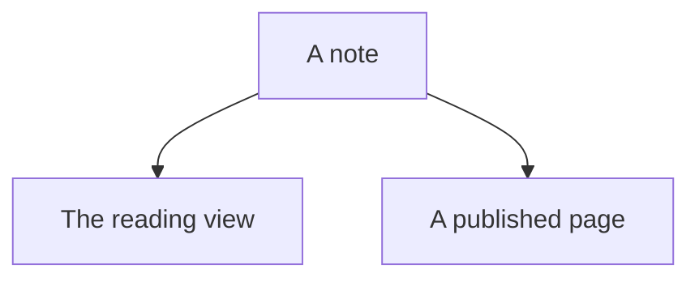

# Everything

[toc]

A paragraph with **bold**, *italic*, ~~struck~~, ==marked==, `inline code`,
H~2~O, x^2^, a [link](https://nibeditor.com), a bare https://nibeditor.com,
a wikilink to [[Another note]], an aliased one to [[Another note|the other]],
a heading link to [[Another note#Why it works]], a footnote[^why], inline
maths $e^{i\pi} + 1 = 0$, an abbreviation for HTML, and a #tag in prose.

[^why]: Because a pane and a page should say the same thing.

*[HTML]: HyperText Markup Language

## Second level

### Third level

#### Fourth level

##### Fifth level

###### Sixth level

## A table

| Language | Rows | Weight |
| :------- | :--: | -----: |
| Lezer    |  14  |  1.2 s |
| KaTeX    |  20  | 0.18 s |
| Mermaid  |  0   |      0 |

## Lists

- a bullet
  - nested one level
    - and two
      1. ordered under it
      2. second
- [x] a task that is done
- [ ] one that is not
- [ ] one with **bold** and `code` in it

1. first
2. second
   - a bullet under a number

## Quotes

> A plain quote, with **bold** inside it.
>
> And a second paragraph.

## Callouts

> [!note] Every look there is
> The thirteen Obsidian has, plus the two nib had first.

> [!abstract] The short of it
> One sheet, three places.

> [!info]
> A look with no title of its own.

> [!todo] Still to do
> Fold the rest of them.

> [!tip] Mind the step
> A tip with `code` in it.

> [!important] Read this one
> It matters.

> [!success] It worked
> Every fence coloured.

> [!question] Does it fold?
> Press the title of the next one.

> [!warning] Careful
> A warning about something.

> [!caution]- Folded to begin with
> Shown once the reader presses the title, through `details` and nothing else.

> [!failure] It did not work
> Something went wrong.

> [!danger] Do not
> A hazard.

> [!bug] A defect
> With a number on it.

> [!example] For instance
> Like this.

> [!quote] Somebody said
> Words of theirs.

> [!recipe] A look nobody registered
> Still a callout, carrying its own name.

## Code

```ts src/main.ts
export function greet(name: string): number {
  // A comment, in italics.
  const greeting = `hello ${name}`
  return greeting.length
}
```

```python title="count.py"
def count(rows: list[int]) -> int:
    """How many there are."""
    return sum(row for row in rows if row > 0)
```

```css
#write .hl-keyword {
  color: var(--accent);
}
```

```
A fence that names no language at all.
```

## Maths

Inline $\sqrt{a^2 + b^2}$ in a sentence, and a block of its own:

$$
\int_0^1 x^2\,dx = \frac{1}{3}
$$

## A diagram



## A chart

```chart
type: bar
title: Two quarters
labels: [Jan, Feb, Mar]
series:
  - title: Sales
    data: [3, 5, 2]
  - title: Costs
    data: [1, 2, 1]
```

## Embeds

An embedded note:

![[Another note]]

A picture that carries itself:


A picture by name, at a size:

![[shot.png|320]]

A recording, a film, a paper and a plane:

![[clip.mp3]]

![[demo.mp4]]

![[paper.pdf#page=2]]

![[board.canvas]]

## A page from the web


## Definitions

Markdown
: A way of writing formatted text.
: Also the format itself.

## Notes to the writer

%% Nobody reads this one. %%

<!-- Nor this one. -->

---

The last line, under a rule.
